# Getting Started with our build
With the talking and background information out of the way, we can get on with the fun stuff of actually building the solution.

## Gaining Access to Bedrock models
Before we get to far into the code side of things, we first need to setup a couple of things with Bedrock... namely we need to configure access to the foundational models that we'd like to use. 

To do this, log into the management console of your account and browse to the bedrock console by either using [this link](https://us-east-1.console.aws.amazon.com/bedrock/home?region=us-east-1#/) or by searching for it in the console like what's shown below.

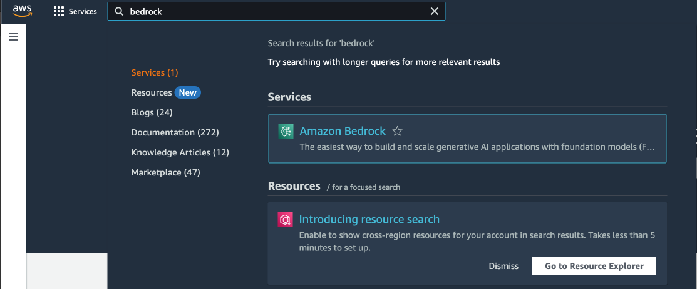

Once there, expanding the side menu and click on "Model Access".

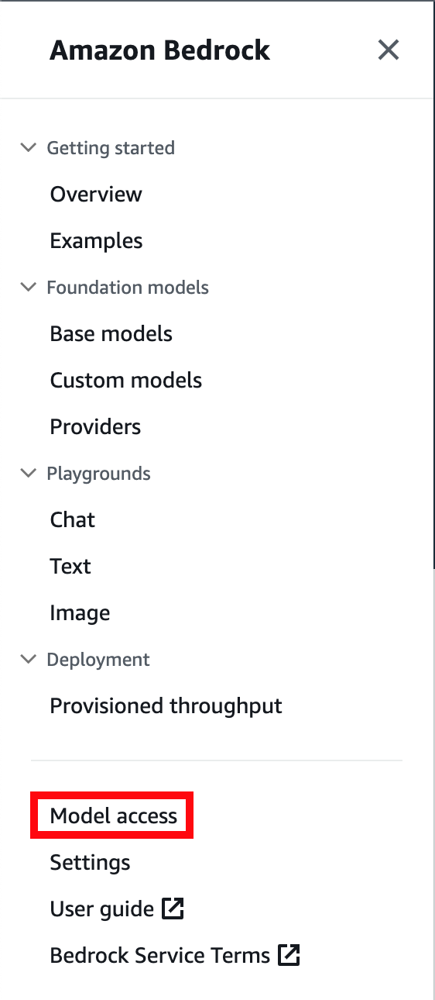

Here we can see all of the foundational models current available to us as well as which ones have all ready have access configured. We need to go ahead and click the "Edit" button up on the top right of the page.

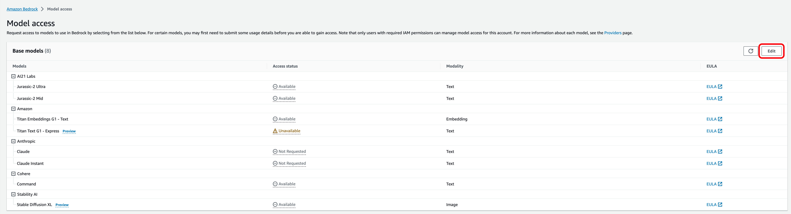

For this workshop we'll need access to two foundational models. We'll need access to "Jurassic-2 Ultra" to generate our video script... and "Stable Diffusion XL" to create our images for us. Go ahead and check the checkboxes next to each of those models and click "Save Changes" to submit the access request.

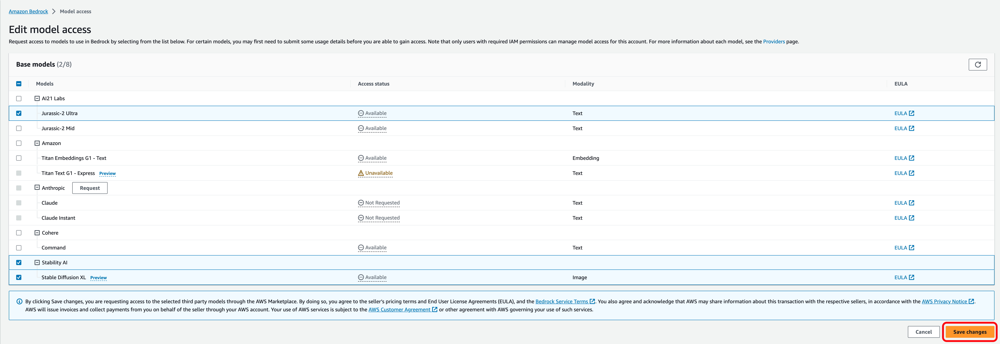

once submitted, you'll get a message saying "It may take several minutes to get access to models" as shown below. Experience to date has shown it's typically only 3-4 minutes before it's processed so just refresh the page to check once the access has been granted.

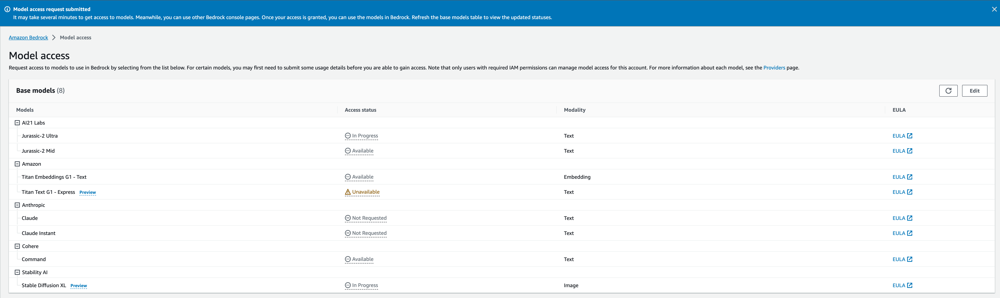

## Trialing Bedrock
Once you've got access to the two foundational models, we can go ahead and test it out using the "Playground" environments within the Bedrock management console. To start with, select "Text" from the left hand menu (remembering you may need to expand it again depending on your computers configuration).

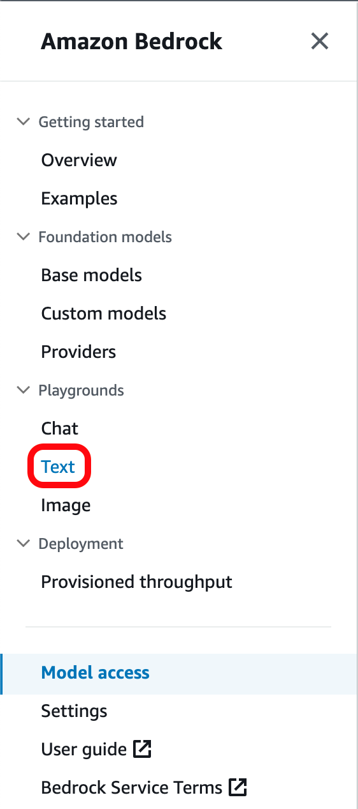

Next, go ahead and select "AI21 Labs" from the first dropdown menu, and "Jurassic-2 Ultra" from the second drop-down.

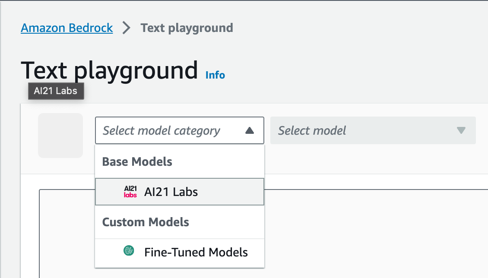

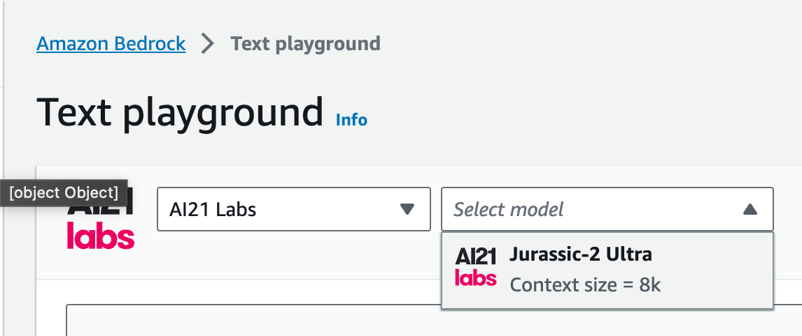

From here, we can start providing some prompts to the service and get back some responses. We can start with the age old "Explain why the sky is blue in a way that an 8 year old would understand."

Type that into the text box and click "Run".

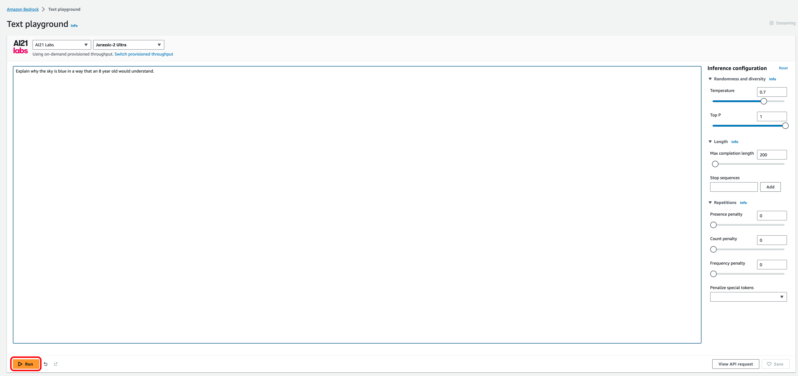

After a couple of moments, you should get back a response.

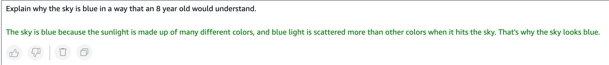

## Taking it a little bit further
So, we know we can query the Foundational Model, now let's see if we can have a crack at getting it to generate our script for us. 

**Audience Participation Time**

Have a crack at seeing if you can right a prompt that will generate a script for a 60 second youtube video and also provide suggested images or scenes throughout the video. Once you've got a working solution, or if you'd just like to move onto the next step... you can take a look at the solution we'll use in the workshop by expanding the section below.

<details>
  <summary>Workshop Solution</summary>

## Prompt 
you are a writer for a new educational YouTube channel focused on producing 60 second YouTube shorts videos.As a part of writing these new videos you need to write both the narrators script as well as call out when scenes should change and what they should change too. 

When calling out a new scene, make sure to wrap the information on a new line, surrounded by square brackets, and when referencing a person or location... make sure to use the whole name (first and last name or town and state). 

The generated script must start by defining the opening scene is as well so there are no parts of the video that are unclear as to the scene design. Based on that, produce a video on "An Introduction to DevOps"

## Response
[Opening scene: A busy office with developers working on their computers.]

Narrator: Welcome to "60 Second Shorts," your bite-sized guide to the world of technology. Today, we're diving into the fascinating world of DevOps.

[Scene change: A visual representation of software development, with developers writing code on one end and operations teams managing infrastructure on the other.]

Narrator: DevOps is a collaborative approach to software development that emphasizes communication and integration between development and operations teams.

[Scene change: A visual representation of DevOps, with developers and operations teams working together.]

Narrator: The goal of DevOps is to increase the speed of software development and delivery, while also improving quality and reliability.

[Scene change: A visual representation of DevOps tools and practices, including continuous integration, continuous delivery, and automated testing.]

Narrator: DevOps is revolutionizing the way software is developed and delivered, and it's an increasingly important skill for IT professionals.

[Scene change: A visual representation of DevOps in action, with developers and operations teams working together to deploy and manage software.]

Narrator: Thanks for watching "60 Second Shorts." Stay tuned for more bite-sized videos on technology topics.

[Closing scene: A busy office with developers working on their computers.]
</details>

With a suitable prompt in hand, we can move onto the next part of testing which is to see what we can do about our images.

## Stable Diffusion
Much like before we can start testing image creation by opening the "Image" playground from the left hand menu

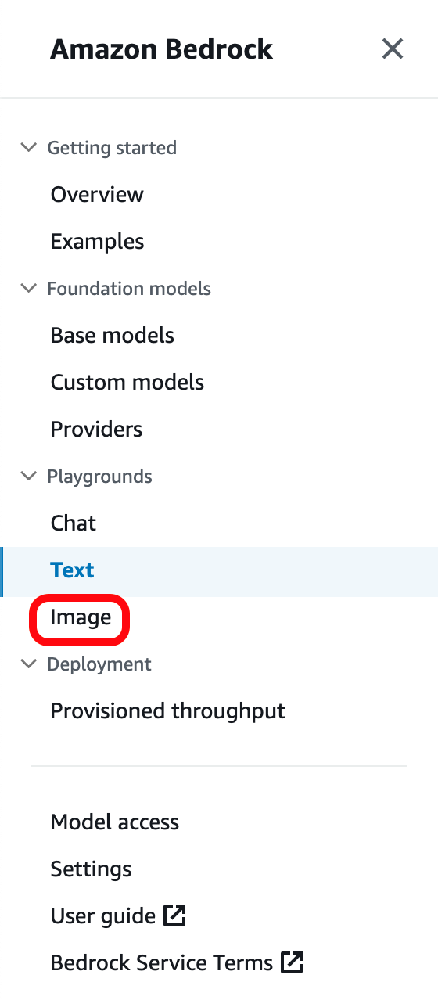

As there is currently only a single image creation foundational model available we don't need to select anything from the dropdown list and can go ahead and start passing in our prompts.

If we take a look at the response from the "Workshop Solution" section above, the first suggested scene was "A busy office with developers working on their computers", so let's put that in as the prompt and click "Run" to see what happens.

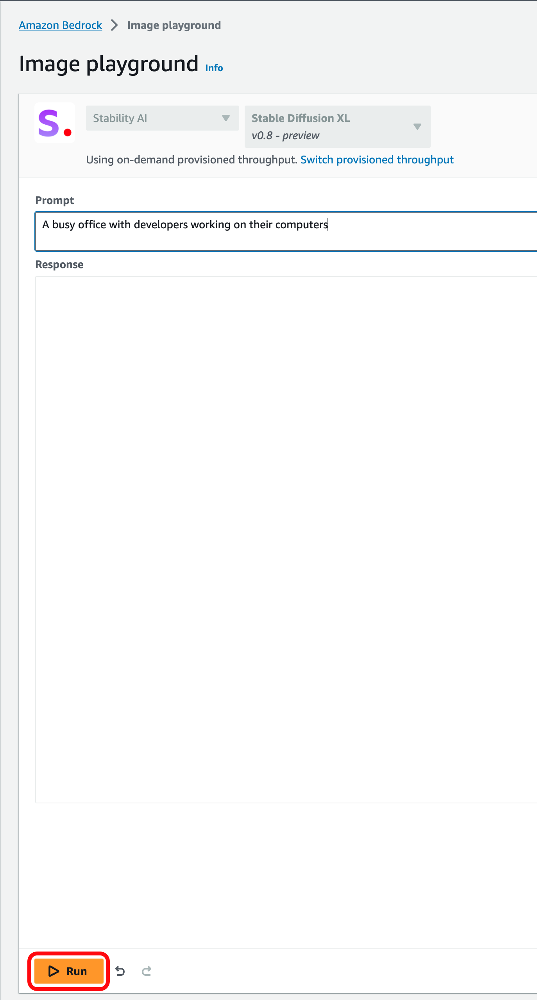

And again, after a couple of moments we get back a response from Bedrock... only this time it's an image... of, an office with an individual working on their computer... Not exactly what i'd call a "Busy" office, but it's a start.

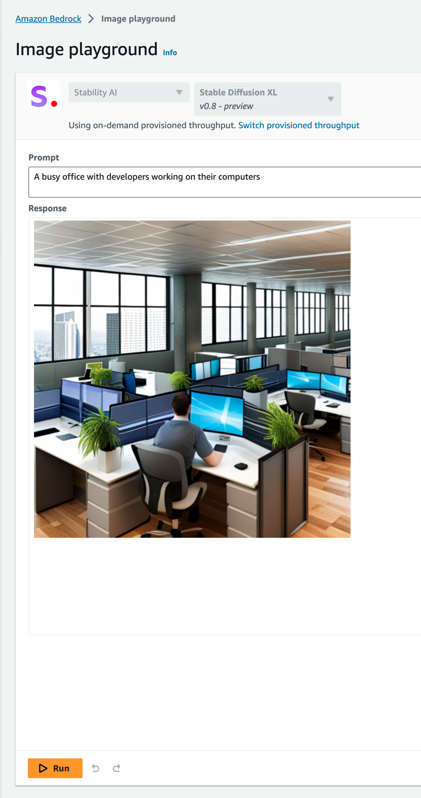

## improving our images
Where this can start to get interesting is when we take a look at the "Inference Configuration" on the right hand side of the screen. These parameters influence how the model behaves and can have a massive impact on the finished result.

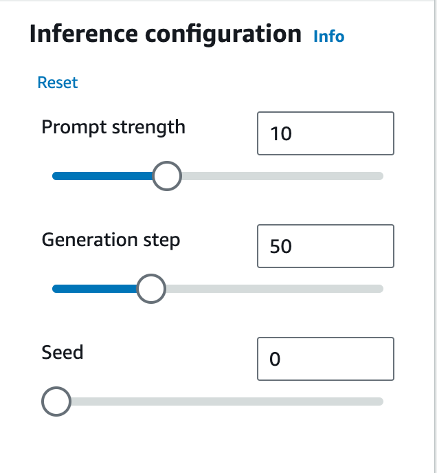
* **Prompt strength** - Determines how much final image portrays prompts.
* **Generation step** - How many times image is sampled. More steps may be more accurate.
* **Seed** - Determines initial noise. Using same seed with same settings will create similar images.

If we go ahead and change some of these values and re-run the query, we can see that we get wildly different results. Spend a couple of minutes changing the different parameters to see how each one influences the final outcome.

<details>
    <summary>Example Solution</summary>

By tweaking the configuration slightly we can actually come up with an image that is a much better fit for what where looking for.

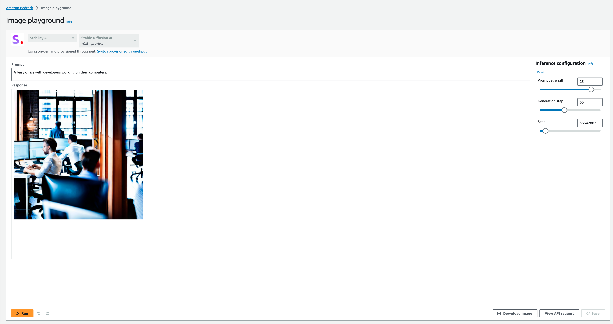
</details>

## Playground to programmatic access
OK, so we can get bedrock to generate our script and the images we'll use in our video... but all of this is clickOps through the management console... not exactly a great example of automation.

We'll, we're getting there... but it's important to understand how these things work before we start blindly throwing code at the problem. It's also (from limited experience given the service has only been GA a few weeks) faster to iterate your prompts in the playground than it is in code (unless you wanted to do some kind of Monte carlo type simulation to optimize your inference configurations... but we'll ignore that for the moment).

But that doesn't mean everything we've done so far has to go to waste. If you take a close look at the playground screen you might notice a little button on the button right of the page labeled "View API request". If you click on it, AWS will actually provide the entire payload needed to generate the request currently in the playground via the API. this is a huge time saver as a number of the date types for these variables change depending on which Foundational Model your using... so it's nice to have a validation point.

```json
{
  "modelId": "stability.stable-diffusion-xl-v0",
  "contentType": "application/json",
  "accept": "application/json",
  "body": "{\"text_prompts\":[{\"text\":\"A busy office with developers working on their computers.\"}],\"cfg_scale\":25,\"seed\":356428821,\"steps\":65}"
}
```

So, we can take this code and leverage in the next phase of the Workshop where we'll actually start building out the solution and leverage the power of Bedrock that we've now unlocked.

Click [here](../stage3/01-SAMSetup.md) to start building out the application.